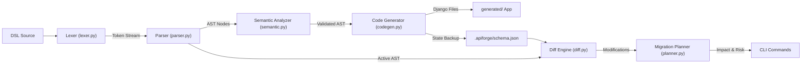
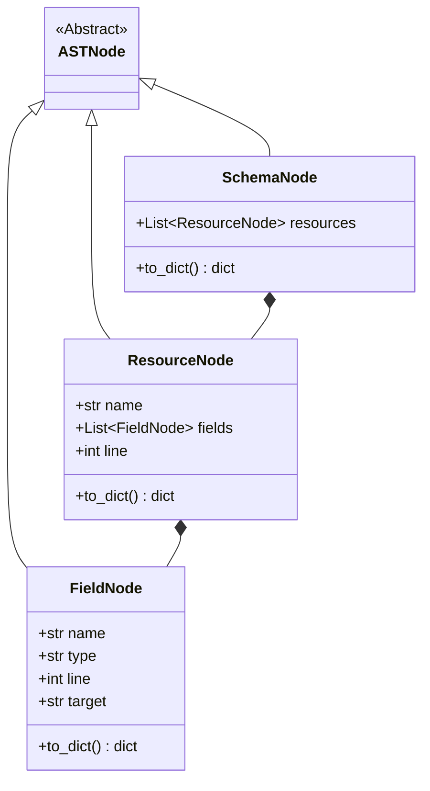
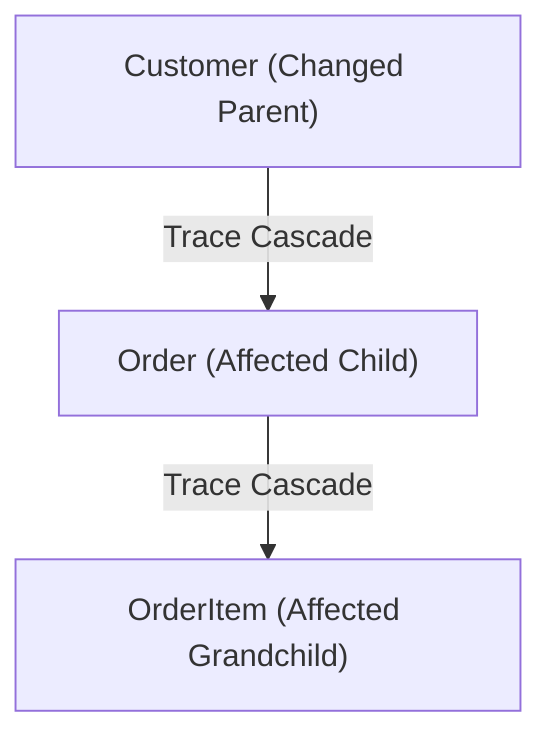

# APIForge System Architecture Guide

This guide details the system architecture, compiler pass design, algorithmic foundations, and system design decisions behind APIForge (Phase 13).

---

## 1. End-to-End Compiler Pipeline

APIForge compiles declarative DSL specifications into operational Django backends through a series of decoupled compiler passes:

### Decoupled Passes Overview
*   **Scanning/Lexical Analysis (`lexer.py`):** Consumes raw characters and maps keywords (`resource`, `belongs_to`), identifiers (`string`, `integer`, custom model names), and curly braces (`{`, `}`) to structured `Token` coordinates.
*   **LL(1) Recursive Descent Parsing (`parser.py` & `ast.py`):** Translates token streams into a hierarchical tree structure of type-safe Abstract Syntax Tree (AST) nodes.
*   **Semantic Validation (`semantic.py`):** An independent semantic checker that performs casing conventions checks (e.g. CamelCase models, snake_case fields), duplicate declarations validation, and target referential integrity audits (verifying that all `belongs_to` references target existing models).
*   **Django Code Generator (`codegen.py`):** Standardizes AST properties into valid Python code templates representing models, serializers, viewsets, and URL routes, packaging them as a self-contained Django project.
*   **Snapshot Management (`snapshot.py`):** Serializes baseline AST trees in a clean, JSON representation inside `.apiforge/schema.json` to store state across CLI commands.
*   **Intelligent Diff Engine (`diff.py`):** A mathematical diff pass comparing live schema runs against the baseline snapshot, grouping deltas into addition/deletion sets, type updates, and renaming heuristics.
*   **Risk-Rated Migration Planner (`planner.py`):** Formulates physical migration commands, calculates database risk weights, and traverses relationship cascading graphs.

---

## 2. Abstract Syntax Tree (AST) Layout

The Abstract Syntax Tree is modeled in [ast.py](file:///Users/prashantkumar/Documents/APIForge/src/apiforge/compiler/ast.py) and represents parsed programs using three primary classes:

### AST Serialization Bridge
To maintain decoupling between compiler passes, AST nodes implement a `.to_dict()` bridge. This method exports nodes to standard nested Python dictionaries, separating frontend parsing rules from backend generator templates.

---

## 3. Semantic Validation & Spell Correction

The semantic pass in [semantic.py](file:///Users/prashantkumar/Documents/APIForge/src/apiforge/compiler/semantic.py) validates the AST against five primary rules:
1.  **Casing Constraints:** Models must be upper camel case (e.g. `BlogPost`), fields must be lower snake case (e.g. `author_id`).
2.  **Resource Non-Empty Checks:** Ensures resources define at least one field to prevent empty database tables.
3.  **Unique Field Declarations:** Blocks duplicate field names inside the same resource.
4.  **Referential Relationship Integrity:** Checks that target resources bound via the `belongs_to` keyword are declared within the active schema.
5.  **Spelling Suggestions:** Compares invalid field type inputs with valid DSL type tokens (`string`, `integer`, `decimal`, `boolean`, `email`, `belongs_to`) using a sequence matching algorithm, displaying spelling suggestions (e.g. `Unknown type 'decimal_number'. Did you mean 'decimal'?`).

---

## 4. Code Generation Strategy

The code generator translates the schema DSL to standard Django and Django REST Framework structures:

| DSL Type | Django Model Mapping | REST Serializer Mapping |
| :--- | :--- | :--- |
| `string` | `models.CharField(max_length=255)` | `serializers.CharField` |
| `integer` | `models.IntegerField()` | `serializers.IntegerField` |
| `decimal` | `models.DecimalField(max_digits=10, decimal_places=2)` | `serializers.DecimalField` |
| `boolean` | `models.BooleanField(default=False)` | `serializers.BooleanField` |
| `email` | `models.EmailField()` | `serializers.EmailField` |
| `belongs_to` | `models.ForeignKey('<Target>', on_delete=models.CASCADE)` | `PrimaryKeyRelatedField` |

### Smart `__str__` Method Fallback Heuristic
To ensure models present cleanly in Django's admin panel and debug screens, the code generator implements a fallback lookup chain to select the string representative field:
1.  Choose a field named `name`.
2.  If missing, choose a field named `email`.
3.  If missing, search for the first field of type `string` or `email`.
4.  If none exist, fallback to the primary key `pk`.

---

## 5. Schema Evolution Heuristics

### A. Field Rename Detection Math
For any resource $R$, let $D_{added}$ and $D_{removed}$ be the sets of added and removed fields. For each pair $(f_{rem}, f_{add}) \in D_{removed} \times D_{added}$, we compute a weighted confidence score $C$:

$$C = \text{base} + 0.22 \cdot N + 0.08 \cdot P$$

Where:
1.  **Type Compatibility ($T$):** Defines the base score.
    $$\text{base} = \begin{cases} 0.70 & \text{if } f_{rem}.\text{type} == f_{add}.\text{type} \\ 0.20 & \text{otherwise} \end{cases}$$
2.  **Name Similarity ($N$):** Sequence matching distance ratio computed via Gestalt pattern matching (Python's `difflib.SequenceMatcher`).
    $$N = \frac{2 \cdot \text{common\_chars}}{\text{len}(f_{rem}.\text{name}) + \text{len}(f_{add}.\text{name})}$$
3.  **Position Similarity ($P$):** Compares relative indexes of fields within the resource structure. Let $idx_{rem}$ and $idx_{add}$ be field list indexes, and $L_{old}$ and $L_{new}$ be resource field lengths.
    $$pos_{old} = \frac{idx_{rem}}{L_{old}}, \quad pos_{new} = \frac{idx_{add}}{L_{new}}$$
    $$P = 1.0 - |pos_{old} - pos_{new}|$$

*Fields are classified as renamed if $C \ge 0.65$.*

### B. Resource Rename Detection Heuristics
If resources are added and removed in the same compilation pass, we pair them by calculating resource-level confidence:

$$C_{resource} = 0.60 \cdot I + 0.40 \cdot N_{resource}$$

Where:
*   **Field Intersection Overlap ($I$):** Overlapping field names divided by total fields.
    $$I = \frac{|\text{fields}(R_{old}) \cap \text{fields}(R_{new})|}{\max(1, \max(|\text{fields}(R_{old})|, |\text{fields}(R_{new})|))}$$
*   **Name Similarity ($N_{resource}$):** Ratio between old and new resource names.
    $$N_{resource} = \text{SequenceMatcher}(R_{old}.\text{name}, R_{new}.\text{name}).\text{ratio()}$$

*Resources are classified as renamed if $C_{resource} \ge 0.60$.*

---

## 6. Cascade Dependency Impact Traversal

Relational schemas are highly interconnected via ForeignKey constraints. Changing a parent resource cascades to children resources, affecting generated models, serializers, and view controllers.

### Relational Cascade Algorithm
APIForge builds a directed graph of schema dependencies where an edge $A \to B$ means resource $A$ references resource $B$ via `belongs_to`:

When changes occur on resource $P$:
1.  Initialize a BFS queue with $P$ and insert $P$ into a `visited` set.
2.  While the queue is not empty, dequeue resource $V$.
3.  Locate all child resources referencing $V$ via `belongs_to`.
4.  For each child $C$ not yet in `visited`:
    *   Add $C$ to `visited` and enqueue it.
5.  Generate the list of affected resources and flag their target files:
    *   `{resource.lower()}/models.py`
    *   `{resource.lower()}/serializers.py`
    *   `{resource.lower()}/views.py` (if the child model contains active relationships).

---

## 7. Architectural Decisions & Trade-Offs

### Heuristics vs. DSL Annotations
*   **DSL Annotations (e.g. `rename_from "old_name"`):** Avoids false positives, but clutters the schema specification, adding cognitive load for developers.
*   **Heuristics Approach:** Keeps the DSL clean and declarative. By configuring strict math thresholds (e.g. $\ge 0.65$ base confidence), APIForge matches renames with high accuracy. If confidence is low, it safely falls back to separate addition/deletion steps.

### Passive Audits vs. Interactive Prompts
*   **Interactive Prompts:** Blocks automated file watchers, background test runners, and automated CI pipelines.
*   **Passive Audits:** APIForge remains non-interactive. The compiler performs calculations offline, printing risk levels and dependency maps directly to stdout, allowing developers to review migration impacts before execution.
