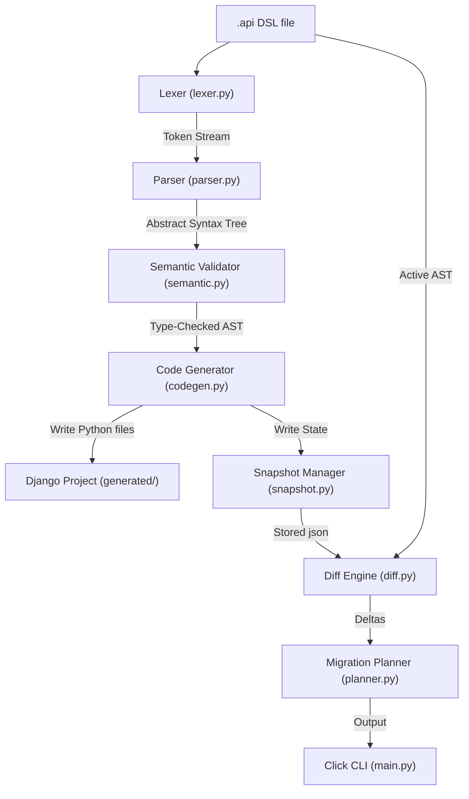

# APIForge

> **APIForge** is a production-grade, incremental API schema compiler and evolution engine that compiles a custom `.api` Domain-Specific Language (DSL) into ready-to-run Django REST Framework (DRF) backend projects.

APIForge manages your database schema state across development iterations. By caching baseline snapshots, it generates precise structural diffs and evaluates migration actions before writing them, protecting you against data truncation and cascading database relationship failures.

---

## ✨ Core Evolution Capabilities

*   **Heuristic Rename Detection:** Automatically flags when resources or fields are renamed (e.g. `price` $\to$ `unit_price`) instead of defaulting to a destructive drop-and-recreate sequence.
*   **Type Change Analysis:** Identifies when field types shift (e.g. `decimal` $\to$ `integer`) and calculates potential coercion risks.
*   **Safety & Risk Classification:** Classifies each plan operation with risk annotations:
    *   `[SAFE]`: Additions and verified field/resource renames.
    *   `[WARNING]`: Data coercion transitions that might truncate precision or fail format checks.
    *   `[DESTRUCTIVE]`: Destructive deletions that drop tables or columns.
*   **Relationship Dependency Cascades:** Traces ForeignKey (`belongs_to`) graphs using BFS to list all child tables and code files affected by a changed parent structure.
*   **Hot-Reload Watch Mode:** Monitors DSL file edits, clearing the console to print active diffs and migration plans instantly upon file saving.
*   **Post-Compile Summary:** Audits compiled resources, fields, and relationships, printing compile times down to the millisecond.

---

## 🛠️ Compiler Architecture

APIForge compiles schemas using a sequence of clean, decoupled compiler passes:



1.  **Lexical Analysis (`lexer.py`):** Scans the source string and emits a structured coordinate-aware token stream.
2.  **LL(1) Recursive Descent Parsing (`parser.py` & `ast.py`):** Consumes tokens to form a type-safe Abstract Syntax Tree (AST).
3.  **Semantic Validation (`semantic.py`):** Enforces casing standards, checks for duplicate definitions, ensures relational referential integrity, and provides Levenshtein spelling suggestions for unknown types.
4.  **Code Generator (`codegen.py`):** Compiles the AST into structured Django files (`models.py`, `serializers.py`, `views.py`, `urls.py`) and scaffolds the root django settings, URLs, and `manage.py` entrypoint.
5.  **State Snapshot Management (`snapshot.py`):** Serializes baseline schema models inside `.apiforge/schema.json` to enable incremental delta analysis.
6.  **Diff Engine (`diff.py`):** Compares live AST runs with the baseline snapshot to compute resource/field additions, deletions, renames, and type updates.
7.  **Migration Planner (`planner.py`):** Formulates risk-rated migration ops and calculates cascading relationship impact graphs.
8.  **Live Watcher (`watcher.py`):** A daemon execution loop that hot-reloads DSL specifications on save.

---

## 🚀 Installation & Setup

1.  **Clone the repository:**
    ```bash
    git clone https://github.com/VaishnaviRai287/Django_Complier.git
    cd Django_Complier
    ```

2.  **Initialize and activate a virtual environment:**
    ```bash
    python3 -m venv .venv
    source .venv/bin/activate
    ```

3.  **Install APIForge in editable mode with development tools:**
    ```bash
    pip install -e .
    ```

---

## 📖 CLI Command Reference

### `apiforge parse <file_path>`
Parses a `.api` specification and outputs its AST dictionary structure in JSON format to stdout.
*   **Example:** `apiforge parse examples/product.api`

### `apiforge generate <file_path> [--output-dir <dir>]`
Compiles a `.api` layout into a fully configured Django backend, establishes/saves the schema snapshot, and prints a Compilation Report summary with a recommended next step based on evolution risks.
*   **Example:** `apiforge generate examples/product.api -o generated`

### `apiforge apply [--dir <dir>]`
Locates the generated Django project, runs database migrations (`makemigrations` and `migrate`), and reports success/failure metrics.
*   **Example:** `apiforge apply`

### `apiforge snapshot`
Loads and outputs the active persistent schema snapshot cached inside `.apiforge/schema.json` to console.
*   **Example:** `apiforge snapshot`

### `apiforge diff <file_path>`
Compares the active `.api` specification against the baseline snapshot and reports structural modifications.
*   **Example:** `apiforge diff examples/product.api`

### `apiforge plan <file_path>`
Reviews modifications, outputs risk-classified migration commands (`[SAFE]`, `[WARNING]`, `[DESTRUCTIVE]`), and lists all cascading relational component impacts.
*   **Example:** `apiforge plan examples/product.api`

### `apiforge watch <file_path>`
Launches a polling file daemon that recompiles, checks, diffs, and plans updates live in the terminal on save.
*   **Example:** `apiforge watch examples/product.api`

### `apiforge info`
Displays current APIForge version, build state, and pipeline capabilities.
*   **Example:** `apiforge info`

---

## 💡 Quick Start Tutorial

### Step 1: Write a DSL Specification
Create a new file named `examples/blog.api` containing relational resource schemas:
```dsl
resource Author {
    name string
    email email
}

resource Post {
    title string
    content string
    author belongs_to Author
}
```

### Step 2: Compile the Django App
Run the generator:
```bash
apiforge generate examples/blog.api
```
This builds a standalone backend inside the `generated/` directory and logs compile performance:
```text
Successfully generated Django app at: /path/to/generated

Compilation Report

Resources: 2
Fields: 3
Relationships: 1

Generated Files:
✓ models.py
✓ serializers.py
✓ views.py
✓ urls.py

Compilation Time: 2 ms
```

### Step 3: Run the Compiled Backend
Apply database migrations using APIForge, navigate into the generated directory, and boot the server:
```bash
# Run migrations on the generated Django project
apiforge apply

# Navigate and start server
cd generated/
python manage.py runserver
```
Visit `http://127.0.0.1:8000/api/` in your browser to interact with the Django REST Framework browsable API!

### Step 4: Evolve the Schema Safely
Return to your workspace root. Open `examples/blog.api` and modify it:
1.  Add a `likes` field to `Post` and change its `content` type to `decimal` (to simulate a pricing field transition).
2.  Rename the `name` field in `Author` to `full_name`.
3.  Add a new `Comment` resource.

Your updated `examples/blog.api` looks like:
```dsl
resource Author {
    full_name string
    email email
}

resource Post {
    title string
    content decimal
    likes integer
    author belongs_to Author
}

resource Comment {
    body string
}
```

Auditing the differences using `diff`:
```bash
apiforge diff examples/blog.api
```
*Expected console print out:*
```text
Added resource:
  Comment

Added field:
  Post.likes

Possible Rename Detected

  Author.name
  →
  Author.full_name

  Confidence: 92%

Field Type Changed

  Post.content

  string
  →
  decimal
```

### Step 5: Generate the Migration Action Plan
To inspect risks and file cascade warnings before compiling, run:
```bash
apiforge plan examples/blog.api
```
*Expected console print out:*
```text
Migration Plan

[SAFE]
AddResource(Comment)

[SAFE]
AddField(Post.likes)

[SAFE]
RenameField(Author.name → full_name)

[WARNING]
ChangeType(Post.content)
string → decimal

Possible database conversion failure if existing values contain non-numeric characters.

Affected Resources

  Author
  Comment
  Post

Affected Generated Components

  author/models.py
  author/serializers.py
  comment/models.py
  comment/serializers.py
  post/models.py
  post/serializers.py
  post/views.py
```

---

## 🧪 Running the Test Suite

Run compiler passes and CLI script tests using pytest:
```bash
pytest tests/ -v
```

---

## 📄 License
This project is licensed under the MIT License.
